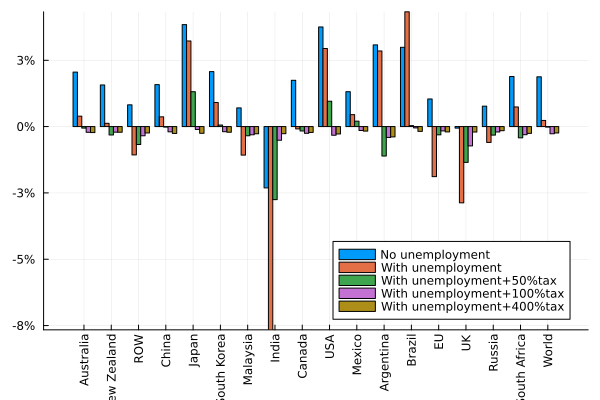
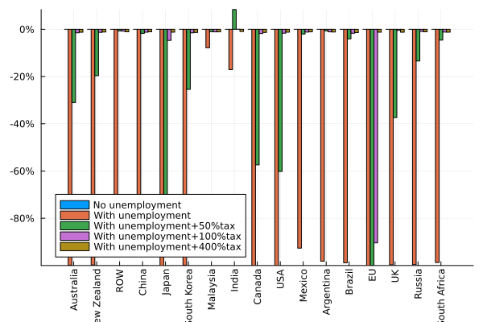

# Results

## Allowing for substitution of clerical labor by AI

In this scenario, we modified the model to allow for labor to be substituted with artificial intelligence on par, i.e., one unit of labor can be substituted with one unit of AI. The units are scaled in the baseline to have the same price in each region; i.e., one unit of labor costs the same as one unit of AI. We implement this substitution using a CES function with the substitution elasticity of 20 in order to allow almost linear one-for-one replacement. We allow the substitution to happen in each industry and each region in the world. Additionally, we assume that imported and domestic AI are as substitutable when used as labor replacement as they are when used an input (the ESUBD value in the GTAP model).

In our sceanrio, we assume the standard closure of fixed quantities of factors. This means that supply of labor is perfecntly inelastic. We find that allowing for a replacement of clerical labor with AI results in a steep declines in depand for clerical labor and a sharp reduction in its returns (@tbl-scenario1a-real-factor-prices). The real returns to other factors, especially land, capital and tecnical labor increase.


: Real factor price changes as a result of implementing a technology to substitute clerical labor on par with no-unemployment assumption for all labor (wages adjust){#tbl-scenario1a-real-factor-prices}

Real domeestic prices are impacted to a much smaller degree (@tbl-scenario1a-real-commodity-prices) with the largest increases observed in crops, animals, extract. The real price of AI, on the other hand changes very little, and it many regions falls.


: Real commodity price changes as a result of implementing a technology to substitute clerical labor on par with no-unemployment assumption for all labor (wages adjust){#tbl-scenario1a-real-commodity-prices}

The resulting change in equivalent varaion are presented in @fig-scenario1-equivalent-variation. The figure shows that the change in the technology that allows the replacement of clerical labor with AI leads to substantial improvements in global welfare, wiht most countries experiencing welfare gains;  only India and the UK (in our sample) experience welfare losses.

{#fig-scenario1-equivalent-variation}



: Real factor price changes as a result of implementing a technology to substitute clerical labor on par with unemployment assumption for clerical labor (fixed clerical nominal wages) {#tbl-scenario1b-real-factor-prices}


: Real commodity price changes as a result of implementing a technology to substitute clerical labor on par with unemployment assumption  for clerical labor (fixed clerical nominal wages) {#tbl-scenario1b-real-commodity-prices}

{#fig-scenario1b-quantity-qe-clerks}