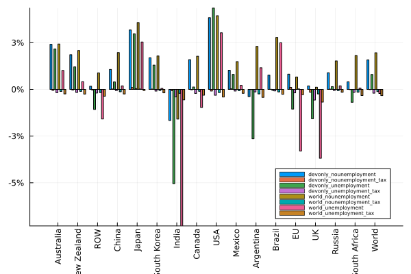
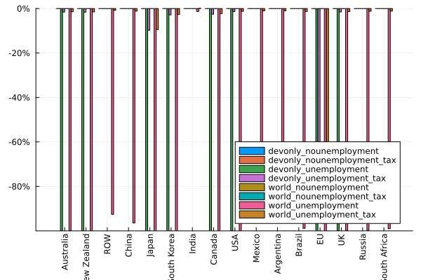

# 5. Results

## 5.1 Allowing replacement of clerical labor by AI

We modify the model to allow for clerical labor to be substituted with artificial intelligence on par, i.e., one unit of labor can be substituted with one unit of AI. The units are scaled in the baseline to have the same price in each region; i.e., one unit of labor costs the same as one unit of AI. We implement this substitution using a CES function with a substitution elasticity of 20 in order to allow almost linear one-for-one replacement. We consider several versions of this scenario. In the first scenario, we assume that only developed countries adopt AI to replicate their clerical labor only and that total employment of clerical labor remains the same with wages adjusting (devonly_nounemployment). In the second scenario, we also assume that only developed countries implement the technology but we assume the clerical labor wages remain fixed and, instead, the total employment adjusts (devonly_unemployment). In the third scenario, we assume that the whole world adopts the technology and that clerical employment in each country remains unchanged (world_nounemployment). Finally, in the fourth scenario we assume that the whole world adopts the technology and that the quantity of clerical labor adjusts while their wages remain stable (world_unemployment).

\scriptsize



:   Real factor price changes as a result of all developed countries implementing a technology to substitute clerical labor on par with no-unemployment assumption for all labor (wages adjust) {#tbl-scenario1a-real-factor-prices}

\normalsize

\scriptsize



:   Real consumer price changes as a result of all developed countries implementing a technology to substitute clerical labor on par with no-unemployment assumption for all labor (wages adjust) {#tbl-scenario1a-real-commodity-prices}

\normalsize

\scriptsize



:   Commodity output as a result of all developed countries implementing a technology to substitute clerical labor on par with no-unemployment assumption for all labor (wages adjust) {#tbl-scenario1a-real-commodity-prices}

\normalsize

\scriptsize



:   Real factor price changes as a result of all developed countries implementing a technology to substitute clerical labor on par with unemployment assumption for all labor (labor quantity adjust) {#tbl-scenario1a-real-factor-prices}

\normalsize

\scriptsize



:   Real consumer price changes as a result of all developed countries implementing a technology to substitute clerical labor on par with unemployment assumption for all labor (labor quantity adjust) {#tbl-scenario1a-real-commodity-prices}

\normalsize

\scriptsize



:   Commodity output as a result of all developed countries implementing a technology to substitute clerical labor on par with unemployment assumption for all labor (labor quantity adjust) {#tbl-scenario1a-real-commodity-prices}

\normalsize

\scriptsize



:   Real factor price changes as a result of all countries implementing a technology to substitute clerical labor on par with no-unemployment assumption for all labor (wages adjust) {#tbl-scenario1a-real-factor-prices}

\normalsize

\scriptsize



:   Real consumer price changes as a result of all countries implementing a technology to substitute clerical labor on par with no-unemployment assumption for all labor (wages adjust) {#tbl-scenario1a-real-commodity-prices}

\normalsize

\scriptsize



:   Commodity output as a result of all countries implementing a technology to substitute clerical labor on par with no-unemployment assumption for all labor (wage adjust) {#tbl-scenario1a-real-commodity-prices}

\normalsize

\scriptsize



:   Real factor price changes as a result of all countries implementing a technology to substitute clerical labor on par with unemployment assumption for all labor (labor quantity adjust) {#tbl-scenario1a-real-factor-prices}

\normalsize

\scriptsize



:   Real consumer price changes as a result of all countries implementing a technology to substitute clerical labor on par with unemployment assumption for all labor (labor quantity adjust) {#tbl-scenario1a-real-commodity-prices}

\normalsize

\scriptsize



:   Commodity output as a result of all countries implementing a technology to substitute clerical labor on par with unemployment assumption for all labor (labor quantity adjust) {#tbl-scenario1a-real-commodity-prices}

\normalsize

{#fig-scenario1-equivalent-variation}

{#fig-scenario1b-quantity-qe-clerks}