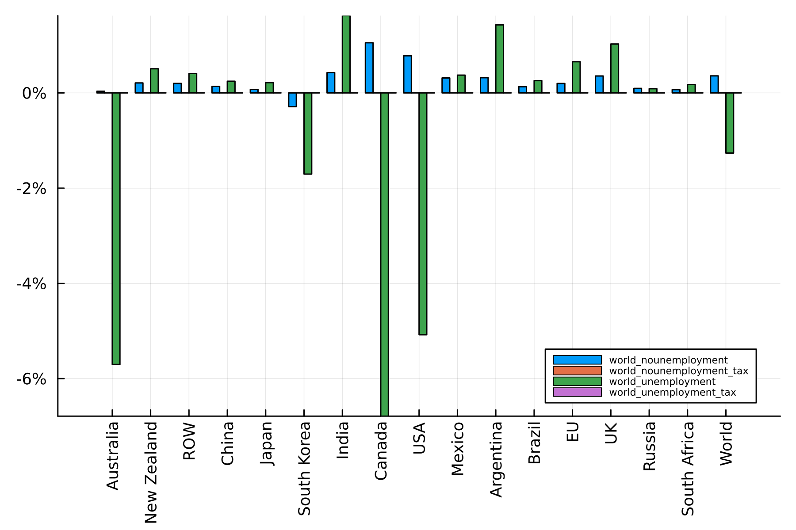
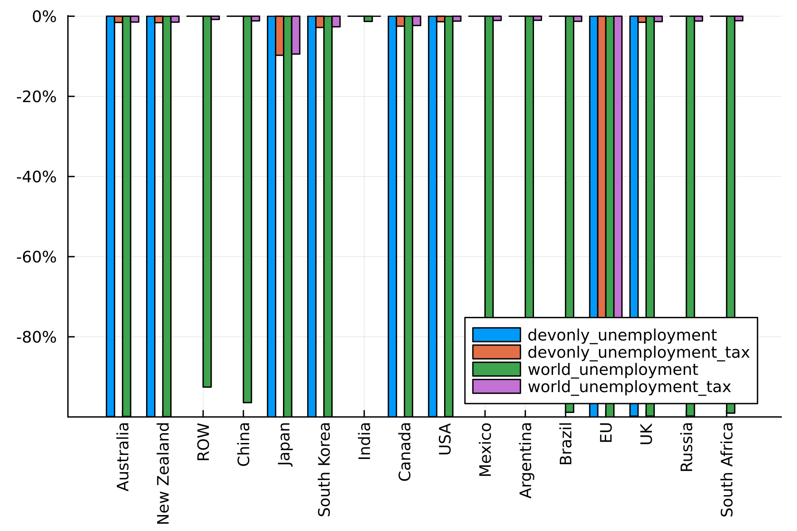
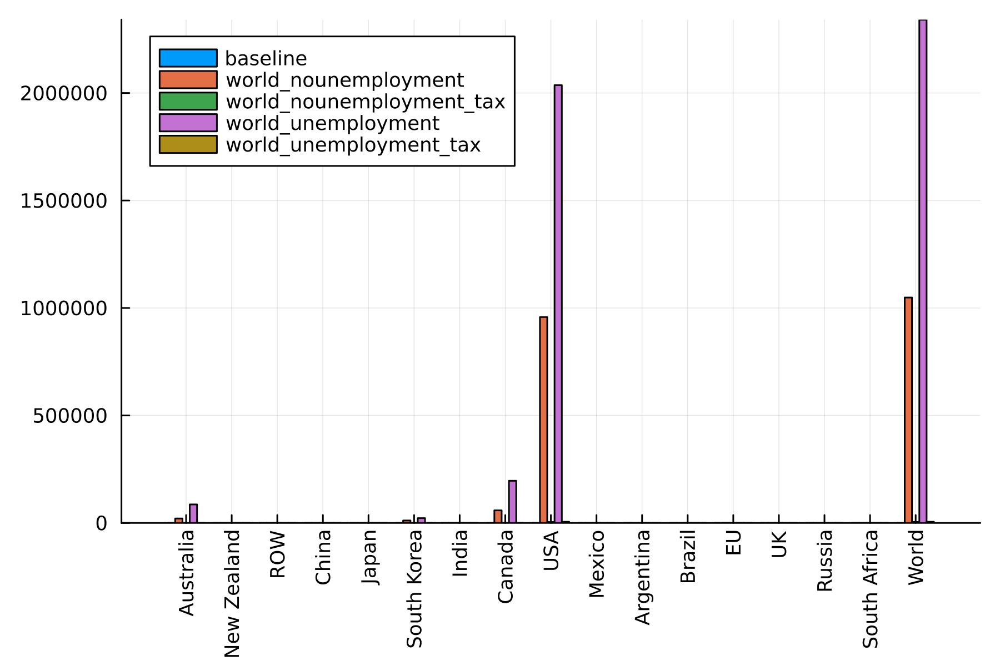
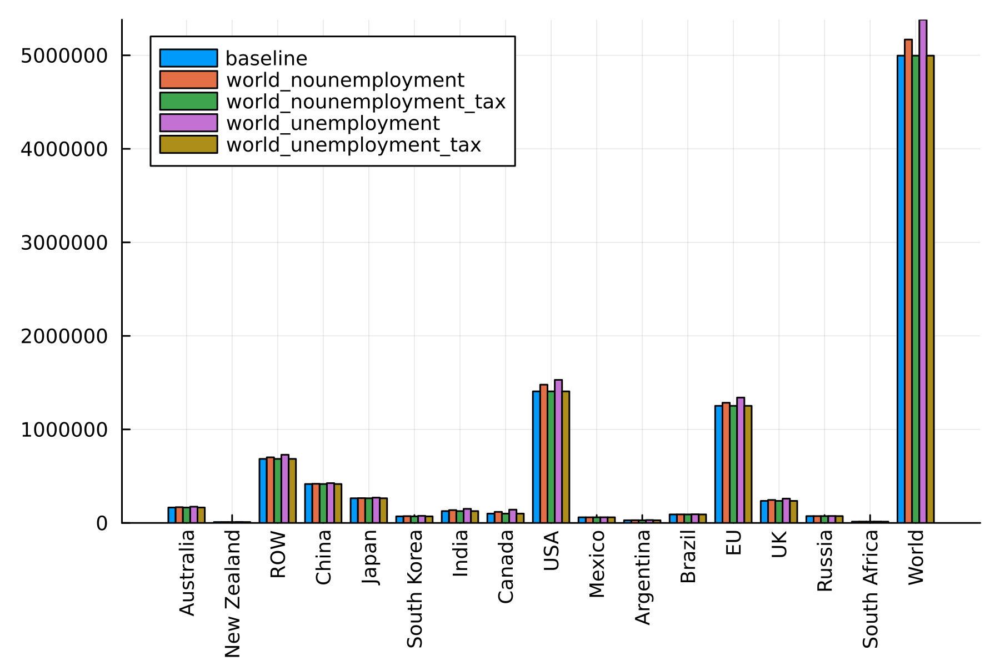

# Results

<!-- - how much adoption of AI there would be under either scenario and in which countries
- differential impacts on incomes, prices and welfare
- how does tax affect adoption and results
- Impacts on the rest of the world -->

## Who adopts AI and in which sectors?

The adoption rate of AI to replace clerical labor varies across regions and sectors, and depends heavily on the assumption of full employment. In both scenarios, we only observe four regions that choose to adopt AI, with the highest clerical wages---Australia, South Korea, Canada and the USA (@tbl-adoption). This reflects the fact that with the same global price of AI assumed to equal the cost of clerical labor in the United States, it makes less sense to use it to replace much cheaper labor in most other countries. In the case of full employment, when labor does not exit the labor market but instead the wage adjusts, the adoption is lower because lower wages make AI less cost effective.  We also note that AI's adoption varies by sector as well, with agricultural sectors (crops and animals) having the lowest adoption rates.

As a result of these market forces, we observe the highest adoption rates in the case of United States in the case of fixed wages scenario (@tbl-adoption-un), where the adoption of AI does not drive the cost of clerical labor down, resulting in full adoption of AI in all sectors. In case of Canada with slightly lower initial clerical wages, the adoption rate is about 96 percent in all sectors except crops (86%) and animals (92%). The adoption rates in Australia are noticeable lower (78% in industry, about 50% in agriculture). Finall, in the case of South Korea, the adoption rate is only 12% across all sectors.

When we assume that AI's adoption does not drive labor out of the labor market but instead it lowers wags, the adoption rates of AI drop significantly in all countries that adop it and in all sectors, as it becomes less cost effective to displace much cheaper labor (@tbl-adoption-nu). The adoption rates remain highest in the USA where they drop from 100 to 45 percent (industry) and about 20 percent in agriculture. The steepest drop in adoption is observed in Australia, where the adotpion rates drops to 18 perent in industries and about 6 percent in agriculture.

::: {#tbl-adoption}

\scriptsize 

: No unemployment {#tbl-adoption-nu}

\normalsize

\scriptsize 


: Unemployment {#tbl-adoption-un}

\normalsize

Adoption of AI by countries and sectors (share of total clerical labor-ai expenditure)
:::

To understand the vast difference between AI adoptions in the two scenarios, it is important to consider the imppact of labor supply asumption on wages which we show in @tbl-wages-aiprice. The decline in wages in the USA is the greatest at -37 percent when AI is adopted, reducing the demand for clerical labor. The wage decine is smaller in the rest of the countries that adopt AI, falling by 20 percent in Canada, 14 percent in Australia and 5 percent in South Korea. Naturally, the strong decline in wages counters AI adoption even though the price of AI also falls in this scenario albeit at a slower rate, e.g., the price of AI falls by only 4 percent in the USA.

\scriptsize 

: Wage impacts on AI adopting countries with full employment assumption {#tbl-wages-aiprice}

\normalsize

## Who are the winners and losers of AI adoption?

Because the impact of replacing clerical labor with AI has economy-wide impacts, we now consider the changes to other factor owners and we contrast them to the overal change in consumer prices (shown in @tbl-marketprices). The tables show that the impacts on returns and consumer prices across countries and scenarios are very mixed. In the full employment scenario, we observe the returns to land owners to rise substnatially in the USA while falling by a simlar rate in Canada. The returns to capital in the USA falls but they increase in Australia, South Korea and Canada. The impacts on consumer prices are mixed as well with consumer prices falling in all countries except Canada. In the fixed wage scenario the impacts are very similar.

Even though the impacts on factor returns and consumer prices are mixed, the impacts on welfare (EV), are much more consistent. In All countries except South Korea, we observe an increase in welfare when full employment is assumed. On the other hand, when labor is allowed to leave the labor market under fixed wage scenario, the welfare impacts are unabiguously negative.

::: {#tbl-marketprices}

\scriptsize 

: No unemployment {#tbl-marketprices-nu}

\normalsize

\scriptsize 


: Unemployment {#tbl-marketprices-un}

\normalsize

Impact of the adoption of AI on factor returns and consumer prices (percent)
:::

## How does the adoption of AI impact those countries that do not adopt AI?

Having observed that the sign of the welfare change in the countries that adopt AI to replace clerical labor depends on whether the displaced labor stays in the market of not, we next consider the implications for the welfare of the rest of the world shown in @fig-welfare-world. An interesting observation of this result is that regardless of the scenario selected, i.e., with full employment or fixed wages, the rest of the countries benefit from the adoption of AI in the four countries. The benefits in the unemployment scenario are larger at about 320 billion US dollars than in the full employment scenario at about 120 billion US dollars. It is also important to note that even though the adoption of AI is expected to benefit the countries that do not adopt it, their gain is much smaller than the impact on the adopting countries. Therefore, the global impact of AI adoption is driven by what happens in those countries that adopt it; in the case when displaced labor leaves the labor market the global welfare falls by about 1.2 trillion US dollars; in the case when clerical labors stays in the market at a lower wage the world gains a little over 300 billion US dollars in welfare.

::: {#fig-welfare-world layout-ncol=2}

{#fig-welfare-world-unemployment}

{#fig-welfare-world-nounemployment}

Welfare impacts of the adoption of AI on the adopting countries, the rest of the countries, and the world (in billions of US dollars)
:::

## How does a tax on AI use affect the adoption?

Having described two scenarios of global adoption of AI to replace clerical labor, we now consider the implication of taxing of computing service when used as a technology used by firms to replace labor. We consider different rates of tax ranging from 0 to 100 percent.

<!-- We modify the model to allow for clerical labor to be substituted with artificial intelligence on par, i.e., one unit of labor can be substituted with one unit of AI. The units are scaled in the baseline to have the same price in each region; i.e., one unit of labor costs the same as one unit of AI. We implement this substitution using a CES function with a substitution elasticity of 20 in order to allow almost linear one-for-one replacement. We consider several versions of this scenario. In the first scenario, we assume that only developed countries adopt AI to replicate their clerical labor only and that total employment of clerical labor remains the same with wages adjusting (devonly_nounemployment). In the second scenario, we also assume that only developed countries implement the technology but we assume the clerical labor wages remain fixed and, instead, the total employment adjusts (devonly_unemployment). In the third scenario, we assume that the whole world adopts the technology and that clerical employment in each country remains unchanged (world_nounemployment). Finally, in the fourth scenario we assume that the whole world adopts the technology and that the quantity of clerical labor adjusts while their wages remain stable (world_unemployment). -->

<!-- \scriptsize

:   Real factor price changes as a result of all developed countries implementing a technology to substitute clerical labor on par with no-unemployment assumption for all labor (wages adjust) {#tbl-scenario1a-real-factor-prices}

\normalsize

\scriptsize

:   Real consumer price changes as a result of all developed countries implementing a technology to substitute clerical labor on par with no-unemployment assumption for all labor (wages adjust) {#tbl-scenario1a-real-commodity-prices}

\normalsize

\scriptsize

:   Commodity output as a result of all developed countries implementing a technology to substitute clerical labor on par with no-unemployment assumption for all labor (wages adjust) {#tbl-scenario1a-real-commodity-prices}

\normalsize -->

<!-- \scriptsize

:   Real factor price changes as a result of all countries implementing a technology to substitute clerical labor on par with no-unemployment assumption for all labor (wages adjust) {#tbl-scenario1a-real-factor-prices}

\normalsize

\scriptsize

:   Real consumer price changes as a result of all countries implementing a technology to substitute clerical labor on par with no-unemployment assumption for all labor (wages adjust) {#tbl-scenario1a-real-commodity-prices}

\normalsize

\scriptsize

:   Commodity output as a result of all countries implementing a technology to substitute clerical labor on par with no-unemployment assumption for all labor (wage adjust) {#tbl-scenario1a-real-commodity-prices}

\normalsize -->
<!-- 
\scriptsize



:   Real factor price changes as a result of all countries implementing a technology to substitute clerical labor on par with unemployment assumption for all labor (labor quantity adjust) {#tbl-scenario1a-real-factor-prices}

\normalsize

\scriptsize



:   Real consumer price changes as a result of all countries implementing a technology to substitute clerical labor on par with unemployment assumption for all labor (labor quantity adjust) {#tbl-scenario1a-real-commodity-prices}

\normalsize

\scriptsize



:   Commodity output as a result of all countries implementing a technology to substitute clerical labor on par with unemployment assumption for all labor (labor quantity adjust) {#tbl-scenario1a-real-commodity-prices}

\normalsize -->

<!-- 
\scriptsize
: Real factor price changes as a result of all developed countries implementing a technology to substitute clerical labor on par with no-unemployment assumption for all labor (wages adjust)  + 100% tax on AI
{#tbl-scenario1a-real-factor-prices}

\normalsize

\scriptsize
: Real consumer price changes as a result of all developed countries implementing a technology to substitute clerical labor on par with no-unemployment assumption for all labor (wages adjust) + 100% tax on AI
{#tbl-scenario1a-real-commodity-prices}

\normalsize

\scriptsize
: Commodity output as a result of all developed countries implementing a technology to substitute clerical labor on par with no-unemployment assumption for all labor (wages adjust)
{#tbl-scenario1a-real-commodity-prices}

\normalsize -->

<!-- 
\scriptsize
: Real factor price changes as a result of all  countries implementing a technology to substitute clerical labor on par with no-unemployment assumption for all labor (wages adjust)  + 100% tax on AI
{#tbl-scenario1a-real-factor-prices}

\normalsize

\scriptsize
: Real consumer price changes as a result of all countries implementing a technology to substitute clerical labor on par with no-unemployment assumption for all labor (wages adjust)  + 100% tax on AI
{#tbl-scenario1a-real-commodity-prices}

\normalsize

\scriptsize
: Commodity output as a result of all countries implementing a technology to substitute clerical labor on par with no-unemployment assumption for all labor (wage adjust) + 100% tax on AI
{#tbl-scenario1a-real-commodity-prices}

\normalsize -->

<!-- 
\scriptsize

: Real factor price changes as a result of all  countries implementing a technology to substitute clerical labor on par with unemployment assumption for all labor (labor quantity adjust)  + 100% tax on AI
{#tbl-scenario1a-real-factor-prices}

\normalsize

\scriptsize

: Real consumer price changes as a result of all countries implementing a technology to substitute clerical labor on par with unemployment assumption for all labor (labor quantity adjust) + 100% tax on AI
{#tbl-scenario1a-real-commodity-prices}

\normalsize

\scriptsize

: Commodity output as a result of all countries implementing a technology to substitute clerical labor on par with unemployment assumption for all labor (labor quantity adjust) + 100% tax on AI
{#tbl-scenario1a-real-commodity-prices}

\normalsize -->

<!-- {#fig-scenario1-equivalent-variation} -->
<!-- 
{#fig-scenario1b-quantity-qe-clerks} -->

{#fig-equivalent-variation-tax}

<!-- {#fig-ai-use} -->

<!-- {#fig-computing-services-use} -->
