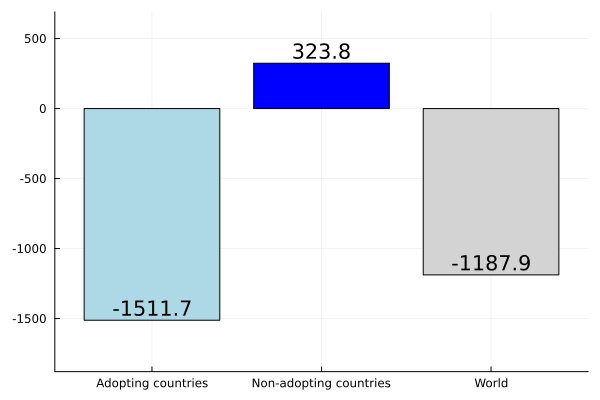
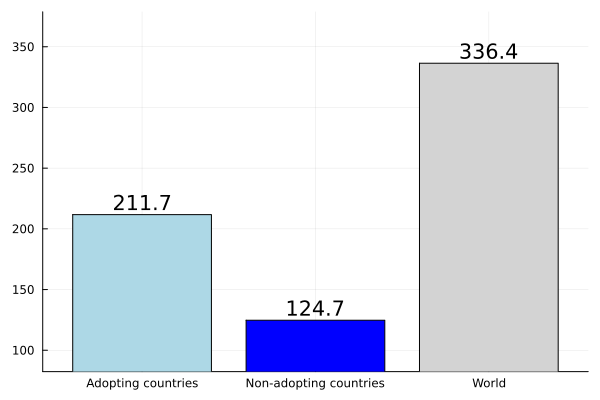
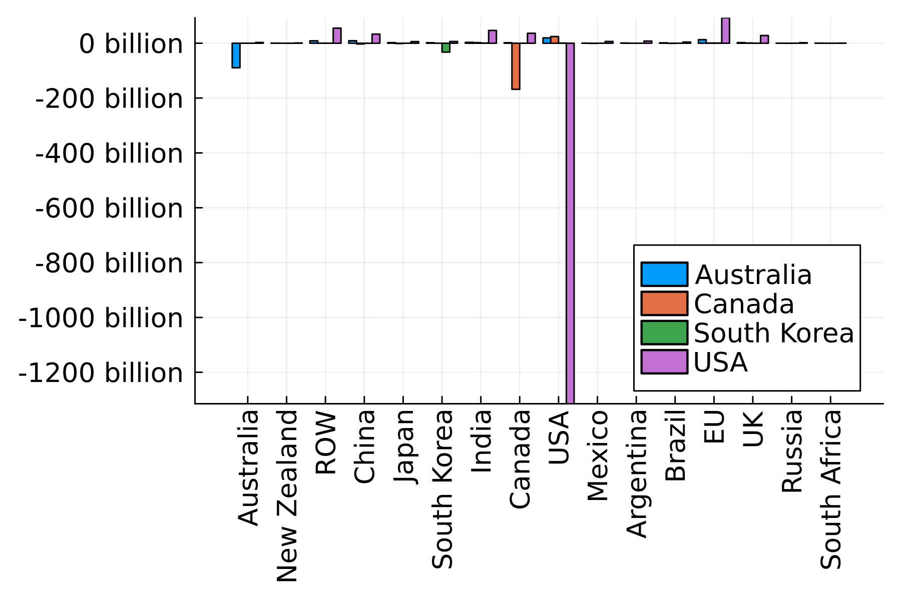
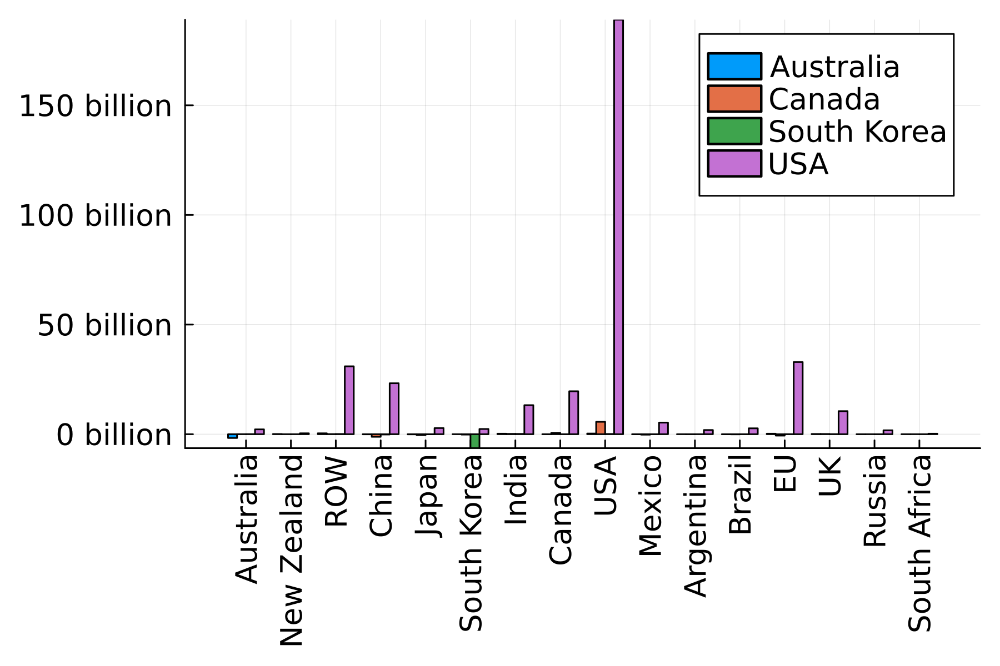
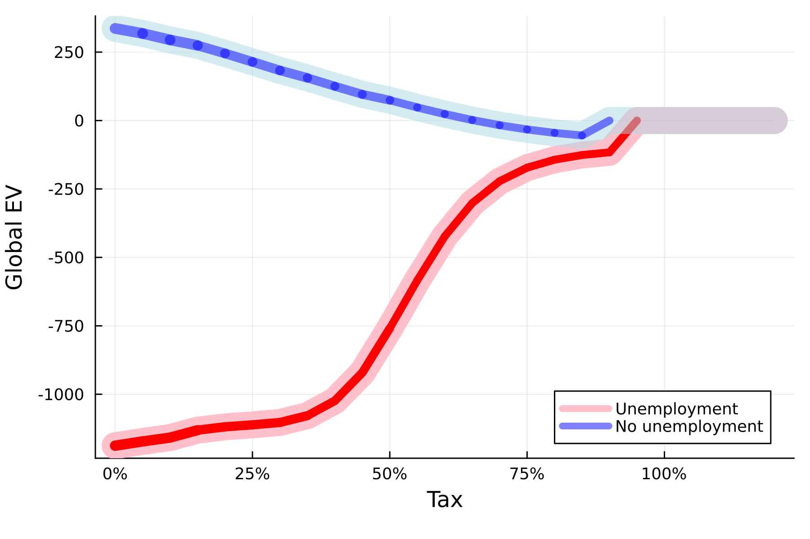

# Results

## Who adopts AI and in which sectors?

The adoption rate of AI to replace clerical labor varies across regions and sectors, and depends heavily on the assumption of full employment. In both scenarios, we only observe four regions that choose to adopt AI, with the highest clerical wages---Australia, South Korea, Canada and the USA (@tbl-adoption). This reflects the fact that with globally connected price of AI, which is assumed to equal the cost of clerical labor in the United States in each region before the implementation of the scenarios, it makes less sense to use it to replace much cheaper labor in most other countries. In the case of full employment, when labor does not exit the labor market but instead the wage adjusts, the adoption is lower because lower wages make AI less cost effective.  We also note that AI's adoption varies by sector as well, with agricultural sectors (crops and animals) having the lowest adoption rates.

As a result of these market forces, we observe the highest adoption rates in the case of United States in the case of the fixed wages scenario (@tbl-adoption-un), where the adoption of AI does not drive the cost of clerical labor down, resulting in full adoption of AI in all sectors. Canada has slightly lower initial clerical wages, their adoption rate is about 96 percent in all sectors except crops (86%) and animals (92%). The adoption rates in Australia are noticeable lower (78% in industry, about 50% in agriculture). Finally, in the case of South Korea, the adoption rate is only 12% across all sectors.

When we assume that AI's adoption does not drive labor out of the labor market but instead it lowers wages, the adoption rates of AI drop significantly in all countries that adopt it and in all sectors, as it becomes less cost effective to displace much cheaper labor (@tbl-adoption-nu). The adoption rates remain highest in the USA where they drop from 100 to 45 percent (industry) and about 20 percent in agriculture. The steepest drop in adoption is observed in Australia, where the adoption rates drops to 18 percent in industries and about 6 percent in agriculture.

::: {#tbl-adoption}

\scriptsize 

: No employment assumption {#tbl-adoption-nu}

\normalsize

\scriptsize 


: Unemployment assumption {#tbl-adoption-un}

\normalsize

Adoption of AI by countries and sectors (share of total clerical labor-ai expenditure)
:::

To understand the vast difference between AI adoptions in the two scenarios, it is important to consider the impact of labor supply assumption on wages which we show in @tbl-wages-aiprice. The decline in clerical wages in the USA is the greatest at -37 percent when AI is adopted, reducing the demand for clerical labor. The wage decline is smaller in the rest of the countries that adopt AI, falling by 20 percent in Canada, 14 percent in Australia and 5 percent in South Korea. Naturally, the strong decline in wages counters AI adoption even though the price of AI also falls in this scenario albeit at a slower rate, e.g., the price of AI falls by only 4 percent in the USA.

\scriptsize 

: Wage impacts on AI adopting countries with full employment assumption {#tbl-wages-aiprice}

\normalsize

## Who are the winners and losers of AI adoption?

Because the impact of replacing clerical labor with AI has economy-wide impacts, we now consider the changes to other factor owners and we contrast them to the overall change in consumer prices (shown in @tbl-marketprices). The tables show that the impacts on returns and consumer prices across countries and scenarios are very mixed. In the full employment scenario, we observe the returns to land owners to rise substantially in the USA while falling by a similar rate in Canada. The returns to capital in the USA falls but they increase in Australia, South Korea and Canada. The impacts on consumer prices are mixed as well with consumer prices falling in all countries except Canada. In the fixed wage scenario the impacts are very similar.

Even though the impacts on factor returns and consumer prices are mixed, the impacts on welfare (EV), are much more consistent. In all countries except South Korea, we observe an increase in welfare when full employment is assumed. On the other hand, when labor is allowed to leave the labor market under fixed wage scenario, the welfare impacts are unambiguously negative.

::: {#tbl-marketprices}

\scriptsize 

: No unemployment assumption {#tbl-marketprices-nu}

\normalsize

\scriptsize 


: Unemployment assumption {#tbl-marketprices-un}

\normalsize

Impact of the adoption of AI on factor returns, consumer prices (CPI) and welfare (EV) (percent)
:::

## How does the adoption of AI impact those countries that do not adopt AI?

Having observed that the sign of the welfare change in the countries that adopt AI to replace clerical labor depends on whether the displaced labor stays in the market of not, we next consider the implications for the welfare of the rest of the world shown in @fig-welfare-world. An interesting observation of this result is that regardless of the scenario selected, i.e., with full employment or fixed wages, the rest of the countries benefit from the adoption of AI in the four countries. The benefits in the unemployment scenario are larger at about 320 billion US dollars than in the full employment scenario at about 120 billion US dollars. It is also important to note that even though the adoption of AI is expected to benefit the countries that do not adopt it, their gain is much smaller than the impact on the adopting countries. Therefore, the global impact of AI adoption is driven by what happens in those countries that adopt it; in the case when displaced labor leaves the labor market the global welfare falls by about 1.2 trillion US dollars; in the case when clerical labors stays in the market at a lower wage the world gains a little over 300 billion US dollars in welfare.

::: {#fig-welfare-world layout-ncol=2}

{#fig-welfare-world-unemployment}

{#fig-welfare-world-nounemployment}

Welfare impacts of the adoption of AI on the adopting countries, the rest of the countries, and the world (in billions of US dollars)
:::

To see specifically the impact of each country adopting AI to replace clerical labor on each country's welfare, we perform a decomposition of the welfare results with respect to each country's contribution.^[We perform the decomposition by running the entire simulation sequentially, adding each country's shocks by sector and recording the impact of each additional shock on each country's welfare.] We show the results in @fig-welfare-world-dec. Clearly, the vast majority of welfare impacts, whether positive or negative, are caused by the adoption of AI in the United States. Even though the impact of the US' own adoption dominates in affecting other countries' welfare, we note that in the scenario allowing for unemployment, Australia's, South Korea's and Canada's own negative impacts dominate their total welfare change. In the case of no unemployment scenario, however, the positive impact of the US adoption generally dominates, with the exception fo South Korea whose own impact drives its overall welfare impact negative.

::: {#fig-welfare-world-dec layout-ncol=2}

{#fig-welfare-dec-world-unemployment}

{#fig-welfare-dec-world-nounemployment}

Welfare impacts of the adoption of AI on the adopting countries, the rest of the countries, and the world (in billions of US dollars)
:::

## How does a tax on AI use affect the adoption?

Having described two scenarios of global adoption of AI to replace clerical labor, we now consider the implication of taxing computing service  when used as a replacement for clerical labor. We consider several rates of the tax ranging from 0 to 100 percent.  In @fig-equivalent-variation-tax, we show the resulting impact of the tax on global welfare for both assumptions of unemployment (red) and no unemployment (blue).  The figure shows that with a tax rate of 95% (or higher) all adoption of AI ceases, resulting in no welfare change to the world. The exact impact of the tax on AI adoption and welfare depends on the whether the displaced clerical labor stays in the market (the no-unemployment assumption) or exits the market (the unemployment assumption). In the former case, increasing the tax rate on AI from 0 to 100 percent would almost linearly reduce its initial benefits to the global economy. On the other hand, if clerical labor exits the labor market, a tax rate below 35 percent would have only a small impact on the associated welfare loss (associated with AI's adoption); to prevent a substantial portion of the welfare loss associated with AI adoption under this assumption, a tax rate of 50% or more is required.

{#fig-equivalent-variation-tax}
